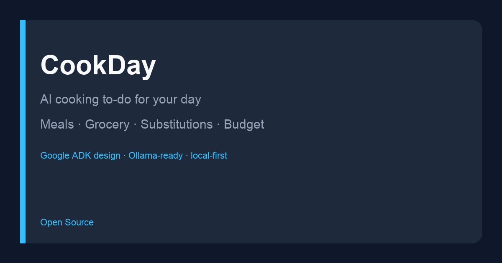

# CookDay



**Personal cooking to-do for your day** — breakfast/lunch/dinner plan, grocery list, substitutions, and budget feasibility. Built with a **Google ADK** multi-agent design and **Ollama** (LiteLLM `ollama_chat`) for local AI, plus a reliable mock planner for offline use.

## Features

- Day-context form (people, time, diet, energy, avoid list, budget)
- Structured **B / L / D** meals with cooking steps and to-dos
- Merged **grocery list** with categories and cost estimates
- **Substitutions** for diet, allergens, and flexibility
- **Budget feasibility** with swap suggestions when over limit
- Modern multi-view web UI (Meals · Grocery · Substitutions · Budget)
- JSON API for agents/scripts
- Default **mock mode** (no model download required); optional live Ollama

## Quick start

```bash
cd project   # or this repo root
python3 -m venv .venv
source .venv/bin/activate
pip install -e ".[dev]"          # core app + tests (fast)
# optional AI stack (can be slow to resolve):
# pip install -e ".[adk]"        # Google ADK agents for `adk web`
# pip install -e ".[ollama]"     # LiteLLM for live Ollama

export COOKDAY_MOCK_LLM=1
python -m app.main
# open http://127.0.0.1:8080
```

Or:

```bash
uvicorn app.main:app --host 127.0.0.1 --port 8080
```

### Live Ollama (optional)

```bash
# small model recommended if disk is limited
ollama pull llama3.2

export OLLAMA_API_BASE=http://localhost:11434
export COOKDAY_OLLAMA_MODEL=llama3.2
export COOKDAY_MOCK_LLM=0
export COOKDAY_FORCE_OLLAMA=1
cookday
```

ADK agent package lives in `cookday_agent/` (`SequentialAgent`: meal → grocery → substitutions → budget). Product API uses the structured `pipeline` for stable JSON; `root_agent` is available for `adk web` when ADK CLI is installed:

```bash
export OLLAMA_API_BASE=http://localhost:11434
adk web .
```

## API

`POST /api/plan`

```json
{
  "people": 2,
  "budget_limit": 35,
  "max_prep_minutes": 30,
  "diet": "omnivore",
  "avoid": ["shellfish"],
  "energy": "low",
  "notes": "Home late"
}
```

Returns `meals`, `grocery`, `substitutions`, `budget`, `source`.

## Use cases

### 1. Busy weeknight parent
**Before:** Stares at the fridge at 6:30pm, orders takeout.  
**After:** Preset “Busy weeknight” → 25-minute max plan, simple meals, grocery list, on-budget check.  
**Try:** UI preset or `energy=low`, `max_prep_minutes=25`.

### 2. Student on a tight budget
**Before:** Meal ideas ignore the $20 limit and overspend.  
**After:** Set `budget_limit=22` → plan + feasibility banner + concrete swaps if over.  
**Try:** `POST /api/plan` with a low budget and inspect `budget.suggested_swaps`.

### 3. Vegetarian with allergies
**Before:** Generic AI menus keep suggesting dairy or meat.  
**After:** `diet=vegetarian`, `avoid=dairy,meat` → meals scrubbed + substitution panel.  
**Try:** Vegetarian preset chip in the UI.

## Why not X?

| Alternative | Why CookDay instead |
|-------------|---------------------|
| Mealime / paid planners | Open source, local Ollama option, single-day micro-flow |
| ChatGPT chat | Structured multi-view product + deterministic budget math |
| Grocery-only apps | Meals + steps + subs + budget in one pipeline |
| Raw `adk web` only | Product UI with empty/loading/tabs for non-dev users |

## Tests

```bash
export COOKDAY_MOCK_LLM=1
pytest -q
```

## Project layout

```text
cookday_agent/   # schemas, tools, ADK agents, pipeline
app/             # FastAPI + Jinja multi-view UI
tests/
docs/images/
```

## Deployed demo

Live on Google Cloud Run (mock planner):

**https://cookday-1035020186370.us-central1.run.app**

Redeploy:

```bash
gcloud run deploy cookday \
  --source . \
  --region us-central1 \
  --project gcpdevelopment-464720 \
  --allow-unauthenticated \
  --set-env-vars "COOKDAY_MOCK_LLM=1"
```

## License

Apache-2.0 — see [LICENSE](LICENSE).
